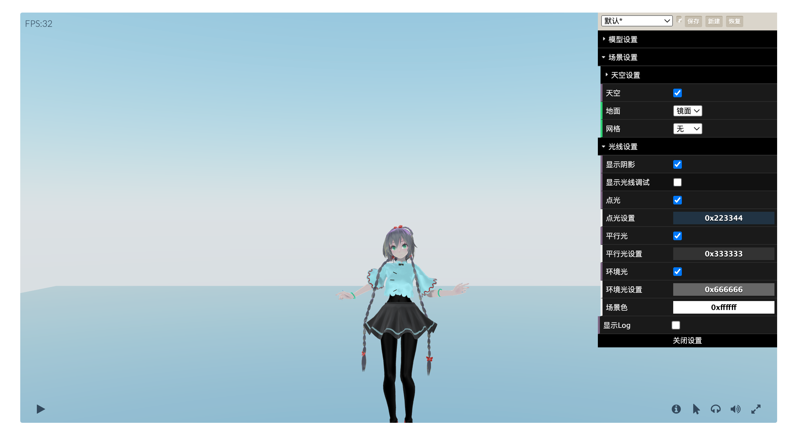

# Introduction
This project is based on the takahirox[https://github.com/takahirox]  mmd-viewer-js[https://github.com/takahirox/mmd-viewer-js] project. 
In fact, my main job is to combine several libraries, such as ground mirroring [Mirror.js] and sky [SkyShader.js] to his mmd project. 
This part of the code is in [main.js]. 
And modified the front page to make it look like a player, and implemented the control of the player in [control.js].
This is a demo I tried to learn threejs at the time, and later this player was applied on my website [niuini.com].
for reference only.

# Modify loaded files
In the index.html line 454 ~ 457 line specifies the address of the load file, you can change it to other URLs, note that the URL is required.
you can not fill it directly like Path, the correct way is to set up a small web server, and fill in the path of the file relative to the root directory of the website.
For more service build, please refer to the official documentation of apache or nginx.

# Links
[https://github.com/takahirox/mmd-viewer-js]
[https://threejs.org]
[http://www.niuini.com]

